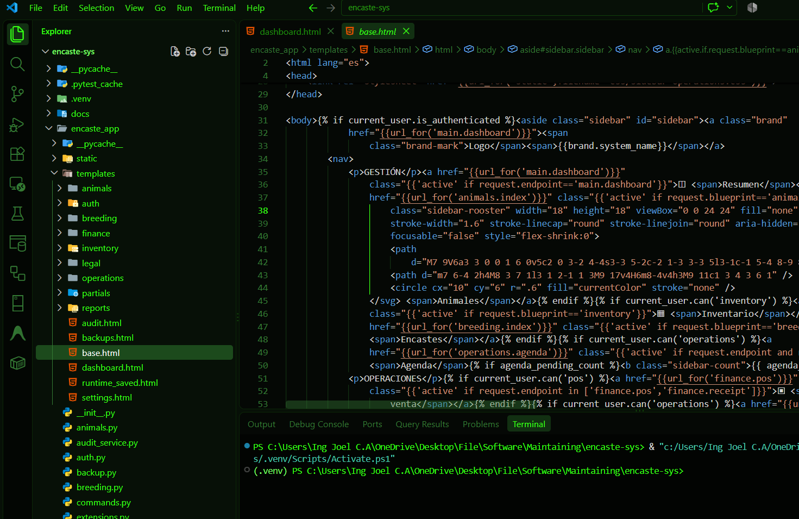
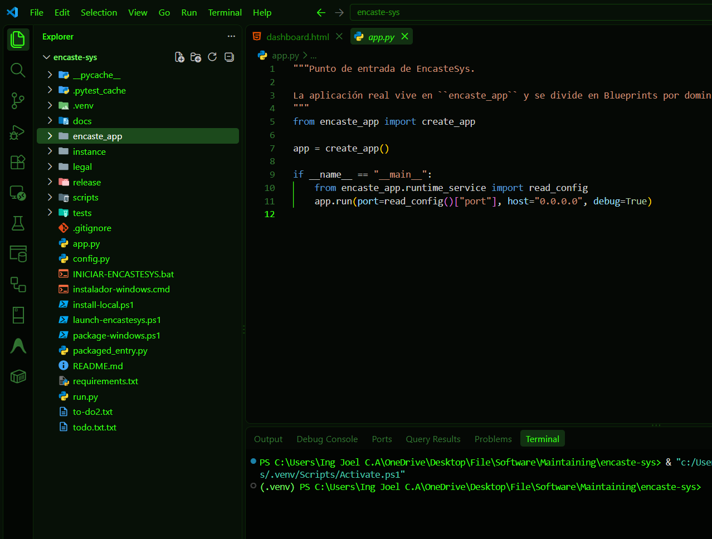
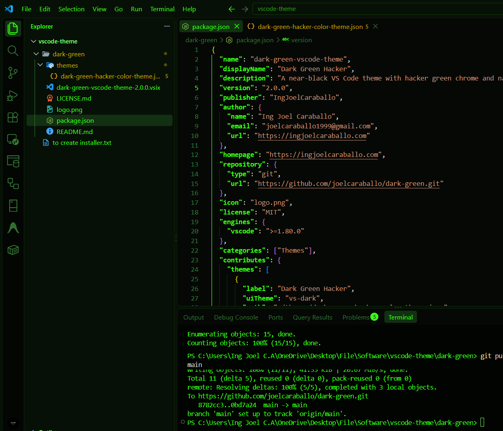
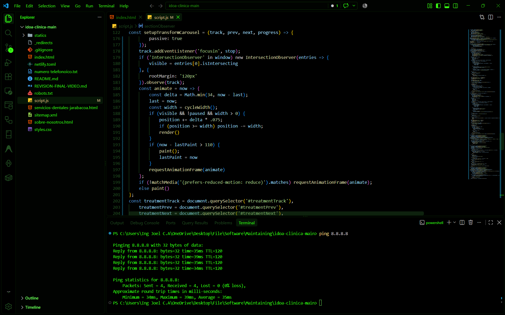

# Dark Green VS Code Themes

A collection of dark VS Code themes built around green accents, high code contrast, and a focused terminal-inspired workspace. The themes keep syntax colors close to VS Code defaults so keywords, functions, strings, classes, and errors remain easy to distinguish.

## Themes

### Dark Green Hacker

The original theme. It uses a very dark green interface with a near-black editor, bright green accents, and native-style syntax highlighting. The surrounding UI has a stronger green presence, which gives the workspace a distinctive hacker-terminal look.

### Deep Dark Green

The darkest and most minimal option. The editor, panels, terminal, and gutters use pure black or near-black backgrounds, while green is reserved for focus states, labels, cursor activity, and important UI elements. It is a good choice for long coding sessions in a dim room when you prefer low visual noise.

### Green Dark Flow

A focused variant of Deep Dark Green with a completely black code editor and the existing green syntax palette. Indentation and bracket-pair guides remain green, while the active guide changes to red so the current nesting level is easier to follow. This is useful when working with deeply nested classes, functions, or configuration files.

## Which Theme Should You Choose?

There is no single theme that protects everyone's eyes. Comfort depends on room lighting, display brightness, font size, contrast, and personal sensitivity. As a starting point:

- Choose **Dark Green Hacker** for the most expressive green interface and strong terminal aesthetics.
- Choose **Deep Dark Green** for the quietest, lowest-distraction workspace.
- Choose **Green Dark Flow** when you want the blackest editor and a clear red indicator for the active code structure.

For better eye comfort, match the editor brightness to the room, avoid using a very bright screen in a dark room, increase the font size when needed, and take regular breaks. These themes are designed to reduce glare and visual clutter, but they are not medical eye-protection products.

## Preview

## Author

**Ing Joel Caraballo**  
[ingjoelcaraballo.com](https://ingjoelcaraballo.com)

Repository: [github.com/joelcaraballo/dark-green](https://github.com/joelcaraballo/dark-green)
